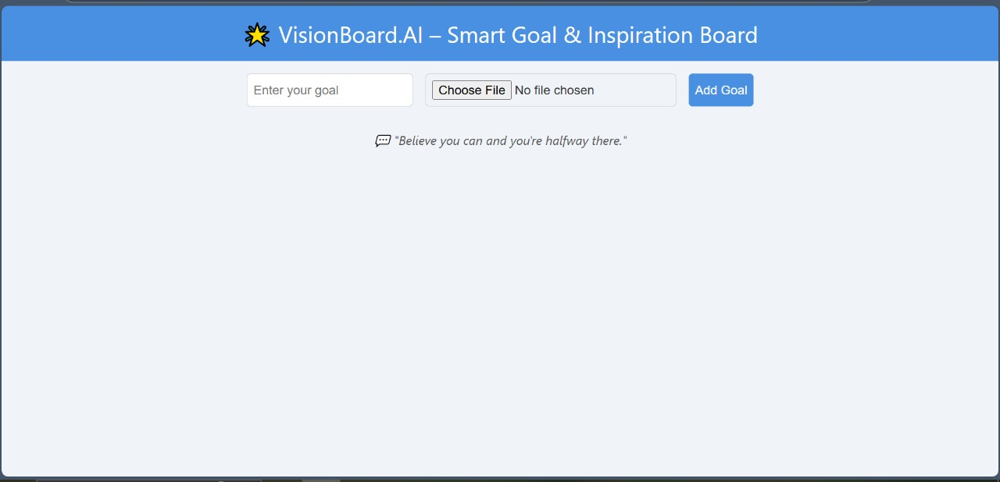
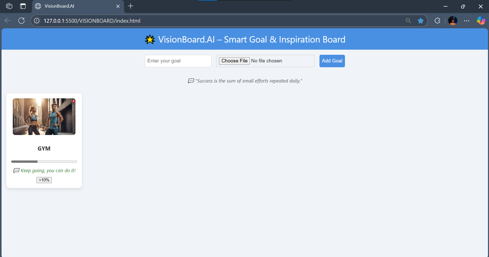
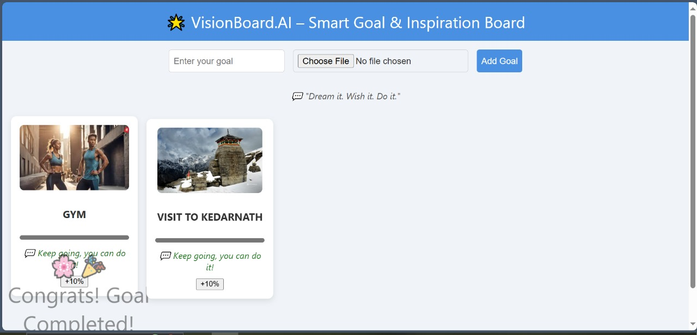
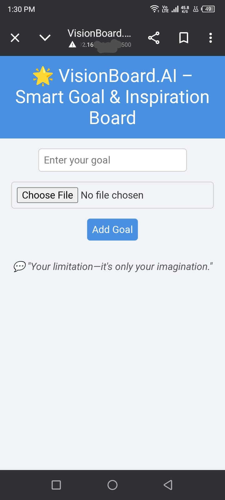

# 🌟 VisionBoard.AI – Smart Goal & Inspiration Board

VisionBoard.AI is a lightweight, front-end web application that lets you visually track goals, stay motivated with daily affirmations, and celebrate progress through interactive animations — all within your browser.

---

## 🚀 Features

- 🎯 Add personal goals with custom images
- 📈 Track progress with a visual progress bar
- 💬 Get random motivational affirmations using a public quote API
- 🎉 Celebrate completed goals with animations
- 🔒 Data is saved locally using `localStorage`
- 💻 Fully responsive design for mobile and desktop

---

## 📸 Demo

> _Screenshots or a short GIF demo can go here_

---

## 🔧 Tech Stack

- **HTML** – Structure
- **CSS** – Styling & Layout
- **JavaScript** – Functionality & Interactivity
- **[Quotable API](https://api.quotable.io)** – For fetching random quotes

---

## 📂 File Structure

📝 Usage
Enter your goal in the input field

Upload a related image (inspirational or relevant)

Click "Add Goal"

Track progress by clicking "+10%"

Watch the animation when you reach 100%

All data is stored locally in your browser

🎯 Example Goals You Can Add
Hit Gym everday for hour and a half

Visit to Kedranath 

Run a marathon 🏃‍♂️

Learn JavaScript 📚

Travel to Japan ✈️

Start a small business 💼

🧩 Limitations
No login system (data is device-specific)

No edit feature for existing goals

Large images increase localStorage usage

No deadline/reminder system (yet)

🙌 Future Improvements
Add ability to edit or delete goals

Introduce due dates and reminders

Support user accounts and cross-device syncing

Categorize goals (e.g., personal, professional, health)

📄 License
This project is open-source and available under the MIT License.

🤝 Contributing
Pull requests are welcome. For major changes, please open an issue first to discuss what you’d like to change.

💡 Inspiration
Inspired by the concept of vision boards and the idea that “what you see daily shapes what you become.”

✨ Author
Your Name – @viresh27

📁 Folder Suggestion
Create a folder named assets/ or screenshots/ in your project root.

Example:

visionboard-ai/
│
├── index.html
├── README.md
└── assets/
    ├── home-screen.png
    ├── goal-added.png
    ├── goal-completed.png
    └── mobile-view.png

## 📸 Screenshots

### 🏠 Home Page
> Goal input interface with motivational quote

---

### 🎯 Goal Card Added
> A goal with an image, progress bar, and affirmation

---

### 📈 Updating Progress
> After clicking +10% a few times

---

### 🎉 Goal Completion Animation
> Confetti message when progress reaches 100%

---

### 📱 Responsive Mobile View
> Works great on mobile screens too!

